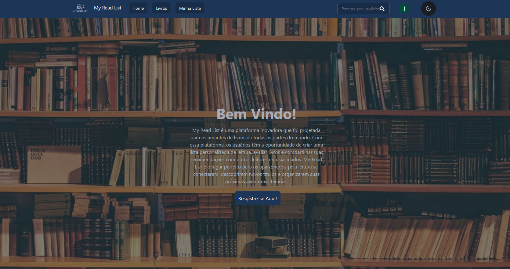

# project4-my-read-list-andriza-e-julio

[Clique aqui para visitar o repositório](https://github.com/elc1090/project3-andriza-e-julio)

# My Read List

Acesso: [Site](https://my-read-list-delta.vercel.app/)

#### Desenvolvedores
- Andriza Campanhol
- Julio Polmann

#### Tecnologias

- HTML
- CSS
- JavaScript
- API
- Next
- React
- Vercel
- TailwindCSS

#### Ambiente de desenvolvimento

- VS Code
- GitHub

#### Proposta

Site para visualização, criação e manipulação de lista de leituras pessoal:
- Controle de status
  - Pretende ler
  - Lendo
  - Finalizado
  - Abandonado
- Notas
- Resenhas
- Demais a pensar
- Seguir outros usários e visualizar suas respectivas listas

Possibilitar adicionar, editar e excluir um livro da sua lista.

---
Projeto entregue para a disciplina de [Desenvolvimento de Software para a Web](http://github.com/andreainfufsm/elc1090-2023a) em 2023a

[Colors](https://coolors.co/192c47-1d3557-254672-fed766-e6e6ea-f4f4f8)
